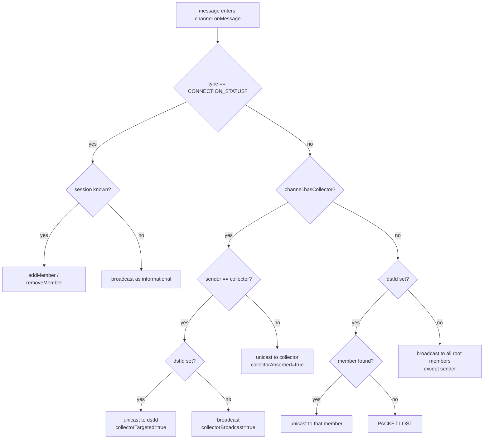

# Routeput Message Routing

This document explains how the Routeput Java server (`src/main/java/org/openstatic/routeput/`) decides where every inbound JSON message goes. Routing is driven by three fields inside the message envelope's `__routeput` meta block:

| Field      | Purpose                                                              |
| ---------- | -------------------------------------------------------------------- |
| `channel`  | Logical room / topic the message belongs to.                         |
| `srcId`    | `connectionId` of the originating session.                           |
| `dstId`    | `connectionId` of a specific intended recipient. Absent ⇒ broadcast. |

Everything below is grounded in:

- [src/main/java/org/openstatic/routeput/RoutePutMessage.java](src/main/java/org/openstatic/routeput/RoutePutMessage.java)
- [src/main/java/org/openstatic/routeput/RoutePutServerWebsocket.java](src/main/java/org/openstatic/routeput/RoutePutServerWebsocket.java)
- [src/main/java/org/openstatic/routeput/RoutePutChannel.java](src/main/java/org/openstatic/routeput/RoutePutChannel.java)
- [src/main/java/org/openstatic/routeput/RoutePutRemoteSession.java](src/main/java/org/openstatic/routeput/RoutePutRemoteSession.java)
- [src/main/java/org/openstatic/routeput/ApiServlet.java](src/main/java/org/openstatic/routeput/ApiServlet.java)
- [src/main/java/org/openstatic/routeput/RoutePutPropertyChangeMessage.java](src/main/java/org/openstatic/routeput/RoutePutPropertyChangeMessage.java)

---

## 1. The Message Envelope

Every Routeput message is a JSON object. Routing metadata is kept under the `__routeput` key (see [`RoutePutMessage.getRoutePutMeta()`](src/main/java/org/openstatic/routeput/RoutePutMessage.java#L84)). A new message is auto-stamped with a `msgId`. A typical packet looks like:

```jsonc
{
  "text": "hello world",
  "__routeput": {
    "msgId": "abc123XyZ",   // auto-generated
    "channel": "lobby",     // required for normal routing
    "srcId":  "kLm9P0qRsT", // sender connectionId (auto-stamped if missing)
    "dstId":  "wXyZ1234aB", // OPTIONAL: target connectionId
    "type":   "chat",       // see RoutePutMessage.TYPE_* constants
    "hops":   ["server-a"]  // appended per hop for tracing / loop visibility
  }
}
```

Relevant accessors on `RoutePutMessage`:

| Method                       | Behavior                                                                            |
| ---------------------------- | ----------------------------------------------------------------------------------- |
| `getChannel()`               | Reads `__routeput.channel`. Returns `null` if absent.                               |
| `getRoutePutChannel()`       | Resolves the channel name via `RoutePutChannel.getChannel(...)`.                    |
| `hasChannel()`               | Whether the meta field is present.                                                  |
| `setChannelIfNull(channel)`  | Only writes the field if it was missing — used by ingress points to set a default.  |
| `getSourceId()`              | Reads `__routeput.srcId`.                                                           |
| `setSourceIdIfNull(connId)`  | Only stamps if missing — this is what preserves `srcId` on relayed messages.        |
| `getTargetId()` / `hasTargetId()` | Reads `__routeput.dstId`.                                                      |
| `setTarget(session)` / `forTarget(session)` | `forTarget` returns a copy with `dstId` set to that session — used when fan-out wants per-recipient stamping. |

---

## 2. Entry Points (ingress)

There are three ways a message gets into the routing pipeline.

### 2.1 WebSocket — `RoutePutServerWebsocket.onText`

Mounted at `/channel/*` (configurable via `websocketMountPath`).

The URL itself participates in routing. On connect (`onConnect`, [line ~352](src/main/java/org/openstatic/routeput/RoutePutServerWebsocket.java#L352)) the path is tokenized:

```
/channel/<name>     -> sets defaultChannel
/id/<connectionId>  -> client requests a specific connectionId
/collector          -> client asks to become the channel collector
```

The handshake (`finishHandshake`, [line ~399](src/main/java/org/openstatic/routeput/RoutePutServerWebsocket.java#L399)) issues a `TYPE_CONNECTION_ID` message back to the client with the assigned `connectionId` and joins the default channel via `RoutePutChannel.addMember(...)`. `addMember` broadcasts a `TYPE_CONNECTION_STATUS` packet to all other channel members.

After the handshake, every incoming JSON frame is parsed into a `RoutePutMessage` and goes through the pipeline below.

### 2.2 HTTP API — `ApiServlet.doPost`

Mounted at `/api/*` (configurable via `apiMountPath`). Two shapes:

- `POST /api/post/channel/<name>[/id/<srcId>]` — body is a single JSON object.
- `POST /api/batch/channel/<name>[/id/<srcId>]` — body is a JSON array of objects.

For each message the servlet sets the channel and source id from the URL using `setChannelIfNull` / `setSourceIdIfNull`, stamps `apiPost`/`apiBatch` in meta, and delegates to the same internal handler used by RemoteSession relaying.

### 2.3 Upstream Client — `RoutePutClient`

When the server is configured with an `upstreams` array in settings, `RoutePutServer.connectUpstreams()` opens client websockets to other Routeput servers. Messages received from upstream feed back into the same dispatch logic as local clients.

---

## 3. The WebSocket Dispatch Pipeline

`RoutePutServerWebsocket.onText` (around [line ~203](src/main/java/org/openstatic/routeput/RoutePutServerWebsocket.java#L203)) is the trunk of routing. In order:

1. **Parse** the text frame as JSON. Non-JSON text is logged and dropped.
2. **Pre-handshake**: only `TYPE_CONNECTION_ID` is honored. It establishes `connectionId`, `defaultChannel`, optional properties and collector flag, then calls `finishHandshake()`.
3. **Property-change messages** (`TYPE_PROPERTY_CHANGE`) are *not* routed normally — they go straight to `RoutePutPropertyChangeMessage(jo).processUpdates(this)`. See §7.
4. **`setSourceIdIfNull(this.connectionId)`** — if the packet has no `srcId`, this socket's own `connectionId` is stamped. This is the single most important rule for distinguishing "this socket spoke" from "this socket is relaying for someone downstream".
5. The dispatcher then branches on `sourceId == this.connectionId`:

```
sourceId == this.connectionId  → message came from the directly attached client
sourceId != this.connectionId  → message belongs to a downstream RoutePutRemoteSession
                                  reachable through this socket; hand it to
                                  RoutePutRemoteSession.handleRoutedMessage(this, jo)
```

6. For directly-attached traffic, the dispatcher first absorbs any inline meta directives that are not really routing payload:
   - `__routeput.setSessionProperty` → converted into a `RoutePutPropertyChangeMessage` and processed locally; the meta field is then stripped.
7. Then it switches on `type`:

| `type`                              | Action                                                            |
| ----------------------------------- | ----------------------------------------------------------------- |
| `TYPE_REQUEST`                      | `handleRequest(jo)` (subscribe/unsubscribe/blob/etc — see §8).    |
| `TYPE_RESPONSE`                     | Ignored at the socket layer.                                      |
| `TYPE_PING`                         | Replies with a `pong` containing both timestamps.                 |
| `TYPE_PONG`                         | Records RTT; fires a `_ping` property-change on this session.     |
| anything else **with** a channel    | Calls `handleMessage(jo)` → `channel.onMessage(this, jo)` (§4).   |
| anything else **without** a channel | Logged as "Lost Message" (unless it's a blob — see below).        |

8. **Blobs are special** ([line ~270](src/main/java/org/openstatic/routeput/RoutePutServerWebsocket.java#L270)): if `type == "blob"`, `BLOBManager.handleBlobData` is invoked regardless of channel/source state.
9. **Echo flag**: if `__routeput.echo == true`, the original packet is sent straight back to the sender with the `echo` flag stripped — this happens at the very end of `handleMessage(...)`.

`handleMessage(jo)` itself ([line ~52](src/main/java/org/openstatic/routeput/RoutePutServerWebsocket.java#L52)) hands off to **the channel** (`channel.onMessage(this, jo)`) and then notifies any per-session message listeners. The channel is where all of the interesting routing decisions live.

---

## 4. Channel-level Routing — `RoutePutChannel.onMessage`

This method (around [line ~510](src/main/java/org/openstatic/routeput/RoutePutChannel.java#L510)) is the dispatcher for in-channel traffic. The big steps:

1. **Sanity check**: `j.getRoutePutChannel().equals(this)`. If a channel is asked to handle a packet that names a different channel, it's logged and dropped.
2. **Logging**: write to `channel.log` if the channel has a log writer and the packet is `canBeLogged()` and not a `pulse`.
3. **`hops` stamp**: if a server hostname is set, append it to `__routeput.hops`. This both aids tracing and lets relays see whether a message has already been through them.
4. **Trap meta `setChannelProperty`**: convert into a `RoutePutPropertyChangeMessage` and process; remove the meta field. This is the same pattern as `setSessionProperty` but applied at channel scope.
5. **`TYPE_CONNECTION_STATUS`**: if `__routeput.connected == true/false` it triggers `addMember`/`removeMember` for the session named by `srcId`. If the channel can't identify a session locally, it just broadcasts the packet so other peers can react.
6. **The main fork** — three modes:

### Mode A — Collector Mode (channel has a registered collector)

A *collector* is a privileged member that mediates all traffic in the channel (`becomeCollector` request, see §8). When `channel.hasCollector()` is true and the message is not a property-change:

- **If the sender IS the collector**:
  - `dstId` set → look up that specific member (`findMemberById(dstId)`), deliver only to them, stamp `__routeput.collectorTargeted = true`. If not found, the packet is dropped.
  - `dstId` not set → broadcast to all members (stamps `collectorBroadcast = true`).
- **If the sender is NOT the collector**:
  - The packet is *absorbed*: it is delivered **only** to the collector (stamps `collectorAbsorbed = true`). Other members of the channel get nothing. The collector is then responsible for deciding what (if anything) to re-emit.

This is the model that powers "moderator" or "game server" channels — every client speaks to one authority, which decides what each client sees.

### Mode B — Free-for-all with a target (`dstId` set, no collector)

```
target = channel.findMemberById(dstId)
if (target != null)  target.send(jo);     // unicast
else                 RoutePutServer.logWarning("PACKET LOST (Target wasn't found): ...");
```

The packet is delivered to exactly one member of the channel and to no one else. There is no fallback broadcast.

### Mode C — Free-for-all broadcast (`dstId` absent, no collector)

```
channel.broadcast(jo);
```

`broadcast` is described in §5.

7. **Log-mirroring side effect**: outside the `routeputDebug` channel, any `error`/`info`/`warning` message is copied as a new packet onto the `routeputDebug` channel.
8. **Per-channel listeners** registered via `addMessageListener(...)` are invoked in parallel after the routing decision.

---

## 5. Broadcast Rules — `RoutePutChannel.broadcast`

`broadcast(jo)` ([line ~688](src/main/java/org/openstatic/routeput/RoutePutChannel.java#L688)) has two modes, selected by whether the message carries a `__routeput.where` filter object.

### 5.1 Filtered broadcast (`where` present)

```
where = jo.__routeput.where     // a JSON object describing required key/values
remove the where field from the message
for each member m of the channel:
    if JSONTools.matchesFilter(m.getProperties(), where):
        m.send(jo.forTarget(m))   // stamps dstId per recipient
```

This delivers to the subset of members whose session properties match the filter. Each recipient receives a copy with their own `connectionId` written into `dstId`, which makes downstream handling treat the packet as a directed unicast.

### 5.2 Default broadcast (no `where`)

```
for each member m of the channel:
    if m.isRootConnection() AND NOT m.containsConnectionId(jo.srcId):
        m.send(jo)
```

Two filters apply:

- **`isRootConnection()`** — only directly-connected sessions receive the broadcast. `RoutePutRemoteSession` instances (proxies for downstream clients reached via another socket) are skipped, because the parent socket already received the packet and will fan it out on its side.
- **Anti-echo** — a member is skipped if its `connectionId` matches `jo.srcId`. This stops senders from receiving their own broadcasts. For root server-websockets it is exact-id equality; the `containsConnectionId` indirection lets composite sessions screen out any of their wrapped ids.

The `hops` array stamped in `onMessage` complements this for multi-server topologies: a relaying upstream can inspect `hops` to avoid sending a packet back into a server it already visited.

---

## 6. Relayed Traffic and `RoutePutRemoteSession`

When this server is connected to another Routeput server (either upstream via `RoutePutClient` or downstream via someone connecting to us), individual end-clients live on the far side of a single websocket. They are represented locally as `RoutePutRemoteSession` instances — they look like normal channel members but their `send()` actually serializes onto the parent socket.

### 6.1 Recognising a relayed packet

In `onText`, after `setSourceIdIfNull(this.connectionId)`:

```
if (srcId == this.connectionId)   → local client                        (§3.7)
else                              → RoutePutRemoteSession.handleRoutedMessage(this, jo)
```

Because the relayed packet already had `srcId` populated by the originating server, the `if-null` stamp is a no-op and the dispatcher knows it is not from the directly-attached client.

### 6.2 `handleRoutedMessage` ([line ~39](src/main/java/org/openstatic/routeput/RoutePutRemoteSession.java#L39))

Keyed by `srcId`:

- `TYPE_CONNECTION_STATUS connected:true` → look up the `RoutePutRemoteSession` for `srcId` or create one with this socket as its `parent`, then deliver the packet (which causes the channel `addMember(this)`).
- `TYPE_CONNECTION_STATUS connected:false` → look up the session and let it process the disconnect (`removeMember`).
- Anything else with a known `srcId` → forward to the existing `RoutePutRemoteSession`, which:
  - Updates `rxPackets`/`lastReceived`.
  - Calls `msgChannel.onMessage(this, m)` — the same channel pipeline as direct messages, but with the *remote session* as the apparent sender.

### 6.3 Sending TO a remote session

`RoutePutRemoteSession.send(jo)` rewrites the packet as `jo.forTarget(this)` (stamps `dstId = this.connectionId`), ensures a channel is set, then writes through the parent socket:

```
this.parent.send(jo);
```

The parent socket's upstream-side server then performs `findMemberById(dstId)` locally and delivers it to the real client. This is what makes `dstId`-based unicast work across server hops without any special protocol — it is just the normal channel rule (Mode B in §4) applied on each hop.

---

## 7. Property-Change Messages — `RoutePutPropertyChangeMessage`

`TYPE_PROPERTY_CHANGE` packets are removed from the normal routing pipeline at the very top of `onText`. Both `RoutePutServerWebsocket` and `RoutePutChannel.onMessage` actively reject them from the dispatcher (the channel will even log a warning if one slips through).

Instead they are processed by `RoutePutPropertyChangeMessage.processUpdates(...)`, which mutates the target session-property or channel-property store and emits its own targeted notification messages to interested members. Session properties live on `RoutePutSession.getProperties()`; channel properties live on `RoutePutChannel.getProperties()` and are persisted to `channel/<name>/properties.json` when modified.

Two inline shortcuts on regular messages get transformed into property-change traffic before any other routing happens:

- `__routeput.setSessionProperty: { key: value-path-or-literal }` — handled in `onText`, mutates the *sender's* session properties (`RoutePutPropertyChangeMessage.addUpdate(this, ...)`).
- `__routeput.setChannelProperty: { key: value-path-or-literal }` — handled in `RoutePutChannel.onMessage`, mutates the channel's properties. Value strings are passed through `RoutePutMessage.getPathValue(...)`, so they can reference fields elsewhere in the same packet.

After being trapped, these meta fields are removed from the original message so the rest of the routing logic does not re-emit them.

---

## 8. Request/Response Traffic (no channel fan-out)

Messages of `TYPE_REQUEST` never reach `channel.onMessage`. They are handled inline by `RoutePutServerWebsocket.handleRequest`, which dispatches on `__routeput.request`:

| Request               | Effect                                                                                    |
| --------------------- | ----------------------------------------------------------------------------------------- |
| `subscribe`           | Join the channel named in meta; reply with channel properties + blob list.                |
| `unsubscribe`         | Leave the channel.                                                                        |
| `becomeCollector` / `dropCollector` | Toggle collector status on the default channel (see §4 Mode A).                |
| `setChannelProperty` / `getChannelProperty` / `getChannelProperties` / `getSessionProperties` | Property RPC. |
| `members`             | Reply with `channel.membersAsJSONArray()` if the requester is a member.                   |
| `upstream`            | Tell the server to open a new upstream client connection.                                 |
| `blob` / `blobInfo`   | Blob transfer RPC via `BLOBManager`.                                                      |

Each reply is built with `RoutePutMessage.setResponse(...)`, which copies the channel from the request and stamps a `ref` field equal to the request's `msgId`. Responses are sent only to the requester — they do not enter channel broadcast.

---

## 9. Decision Summary

Given a message that has been parsed, sourced (`srcId` filled), and accepted into `channel.onMessage`:



And at the broadcast layer:

```mermaid
flowchart TD
    B[broadcast] --> W{where filter present?}
    W -- yes --> W1[for each member matching where:<br/>send forTarget(m) - stamps dstId]
    W -- no --> W2[for each member that is<br/>isRootConnection() AND<br/>connectionId != srcId:<br/>send unchanged]
```

---

## 10. Quick Reference

- **Channel** = topic name → singleton `RoutePutChannel` resolved by `RoutePutChannel.getChannel(name)`. Channels are auto-created on first use, persisted to `channel/<name>/`, and idled out after 10 minutes unless `permanent`.
- **`srcId`** = sender's `connectionId`. Stamped by the socket only if absent (so relays keep the originator). Used for anti-echo on broadcasts and for routing replies through `RoutePutRemoteSession`.
- **`dstId`** = optional intended recipient's `connectionId`. Present ⇒ unicast within the channel (via `findMemberById`); absent ⇒ broadcast. Cross-server unicast is the same rule applied at each hop after `RoutePutRemoteSession.send` stamps the field.
- **Collector mode** overrides the above rules: non-collector traffic always lands at the collector; collector traffic uses the normal `dstId` rules.
- **`where`** meta filter on a broadcast restricts delivery to members whose session properties match, and stamps each recipient's `dstId` for them.
- **`hops`** meta array gets a server hostname appended on every channel pass — useful for multi-server loop avoidance and tracing.
- **`echo`** meta returns a copy of the packet to the sender after routing.
- **PropertyChange / blob / request** messages are handled out-of-band and do not flow through the normal `channel.onMessage` fan-out.
